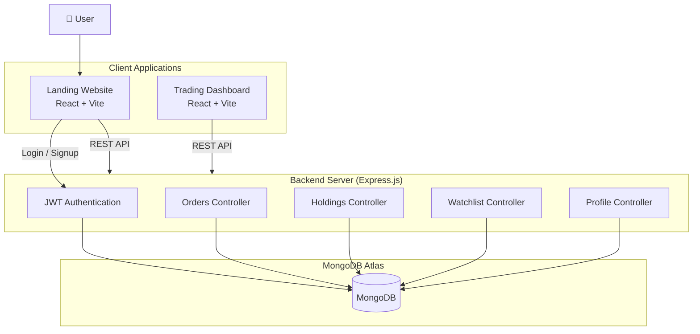
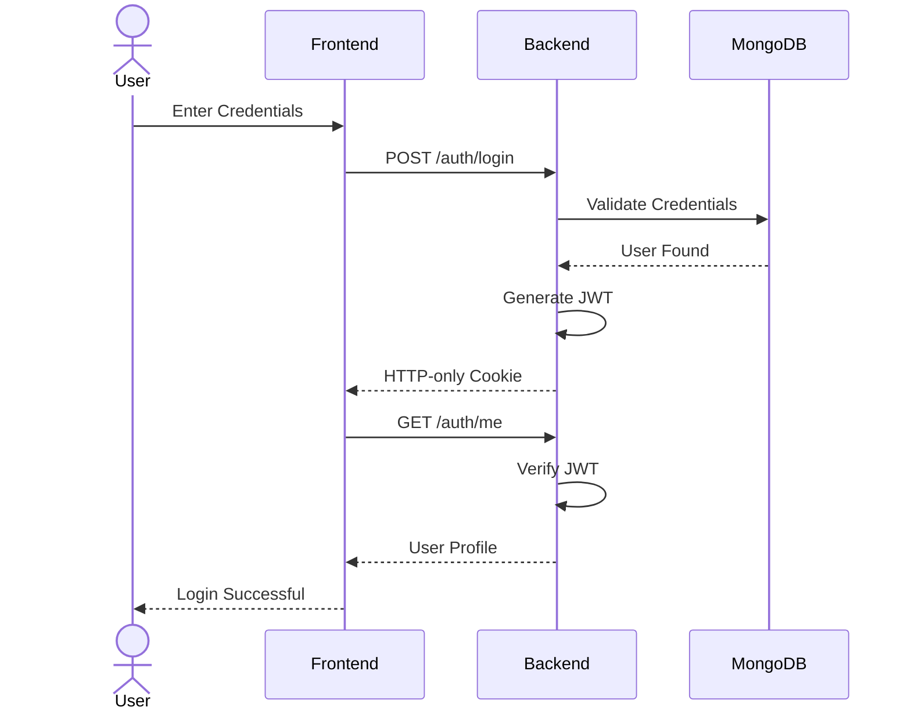

<div align="center">

# 📈 FinLoop

### A Modern Full-Stack Stock Trading Platform Inspired by Zerodha

Built using **React**, **Node.js**, **Express**, **MongoDB**, and **JWT Authentication** with **HTTP-only Cookies**.

<br>


</div>

---

# 🌐 Live Demo

### Landing Website
https://finloop-wrlf.onrender.com

### Trading Dashboard
https://fin-loop-18.onrender.com

---

# 📖 About

FinLoop is a modern stock trading platform inspired by Zerodha that allows users to securely manage their investment portfolio.

The application consists of:

- Landing Website
- Trading Dashboard
- REST API Backend
- JWT Authentication
- MongoDB Database

The project focuses on real-world backend architecture, secure authentication, portfolio management, and production deployment.

---

# ✨ Features

## Authentication

- User Registration
- Secure Login
- JWT Authentication
- HTTP-only Cookie Authentication
- Protected Routes
- Auto Login using `/auth/me`

---

## Dashboard

- Portfolio Holdings
- Orders Management
- Personalized Watchlist
- User Profile
- Investment Summary
- Responsive Dashboard

---

## Security

- JWT Authentication
- HTTP-only Cookies
- Password Hashing using Bcrypt
- Protected API Routes
- CORS Protection

---

# 🛠 Tech Stack

## Frontend

- React 19
- Vite
- Axios
- React Router DOM
- Context API
- CSS

## Backend

- Node.js
- Express.js
- MongoDB Atlas
- Mongoose
- JWT
- Bcrypt
- Cookie Parser
- CORS

## Deployment

- Render
- MongoDB Atlas

---

# 🏗 Application Architecture



---

# 🔐 Authentication Workflow



---

# 📁 Project Structure

```
FinLoop
│
├── backend
│   ├── controllers
│   ├── middleware
│   ├── models
│   ├── routes
│   ├── app.js
│   └── package.json
│
├── dashboard
│   ├── src
│   ├── public
│   └── package.json
│
├── frontend
│   ├── src
│   ├── public
│   └── package.json
│
└── README.md
```

---

# ⚙ Environment Variables

## Backend

```
MONGO_URL=

JWT_SECRET=
```

---

## Frontend

```
VITE_API_URL=
VITE_DASHBOARD_URL=
```

---

## Dashboard

```
VITE_API_URL=
```

---

# 🚀 Installation

Clone the repository

```bash
git clone https://github.com/Jashwanthkashaboina/fin-loop.git
```

Move into project

```bash
cd fin-loop
```

Install Backend

```bash
cd backend
npm install
```

Run Backend

```bash
npm start
```

Install Frontend

```bash
cd ../frontend
npm install
npm run dev
```

Install Dashboard

```bash
cd ../dashboard
npm install
npm run dev
```

---

# 📌 API Endpoints

## Authentication

```
POST /auth/signup

POST /auth/login

GET /auth/me
```

---

## Orders

```
GET /orders

POST /orders

DELETE /orders/:id
```

---

## Holdings

```
GET /holdings
```

---

## Watchlist

```
GET /watchlist

POST /watchlist

DELETE /watchlist/:id
```

# 👨‍💻 Author

**Jashwanth Kashaboina**

GitHub

https://github.com/Jashwanthkashaboina


---

<div align="center">

⭐ If you found this project helpful, consider giving it a star!

Made with ❤️ by **Jashwanth Kashaboina**

</div>
